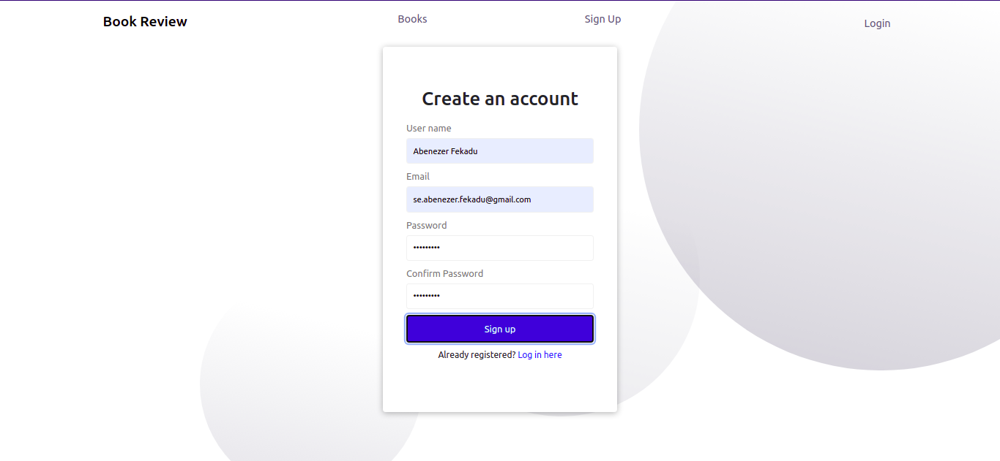
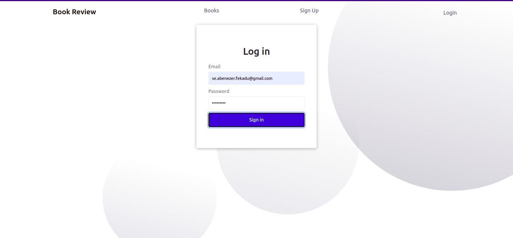
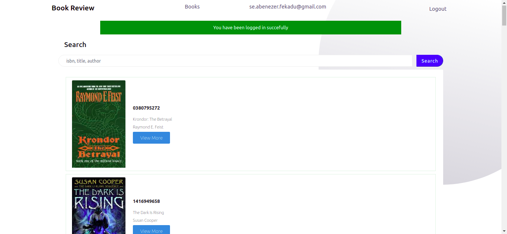
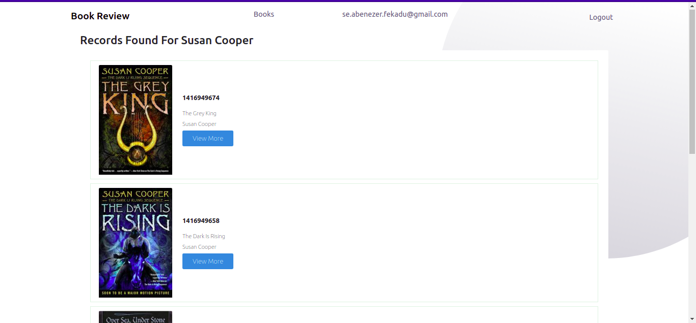
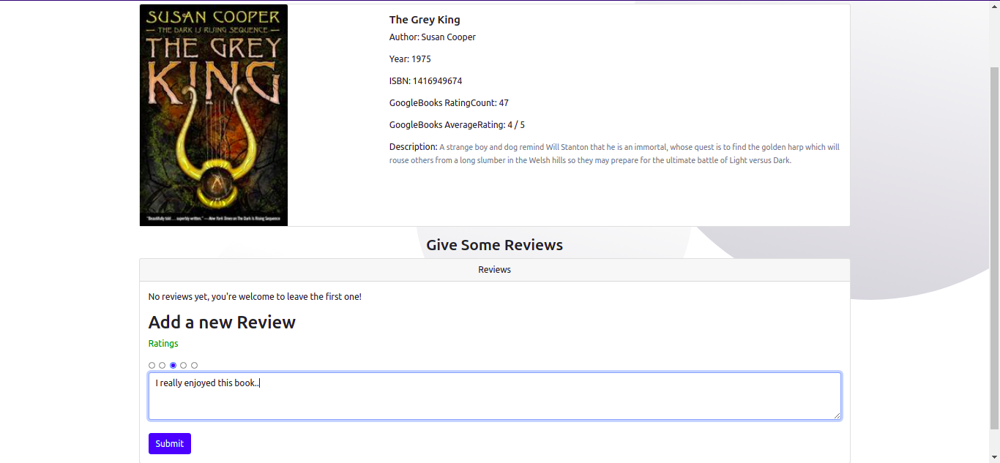
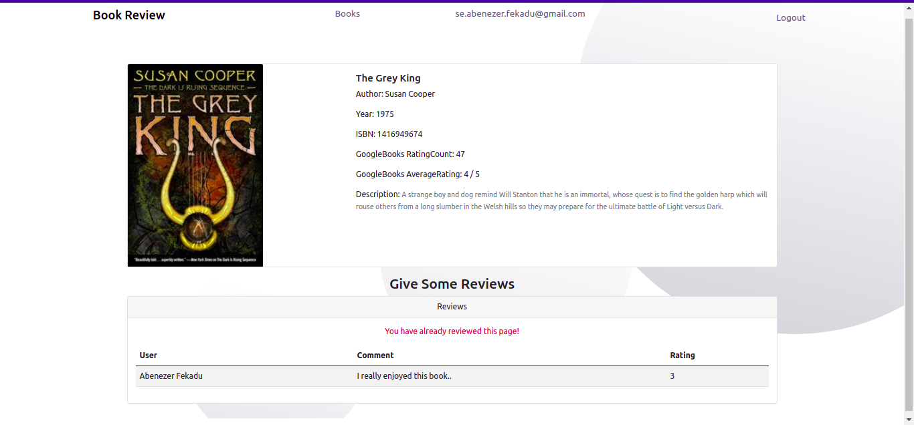

# Books Reviews
This website lets users sign up and search for the book they want by entering isbn or title, even author of the book. Then their individual feedback about the book is stored, also reviews from Google Books is also added inoreder to help them review it easily.

## Welcome Page
Welcome Page so that user can get confertable

## Signup Page
1. Users Should have a unique username and email address (No duplication is allowed)
2. Check password match and hash the password
3. After 1st and 2nd has been validated the user is added to the database and registerd.

## Login
1. Using email and password the user is logged in.
2. if password validation is not success, it prompt the user to enter again.

## Books
1. Books from the databse are displayed with a search bar where user can search a book using isbn, title, author of the book.
2. when the user clicks viewMore the user is taken to the book page 

## Search Page
1. Once the user clicked search button, he(she) will be redirected to the search-page with response for their search.
2. So users can pick what they want
3. Here for example for Susan Cooper

## Book Page
1. Here the user can view the details of a specific book.
2. User can give riview and see GoogleBooks Review 
3. Also other Users review for that book
4. Every user can only give one review for one book.

### **Once the user gave a review** For a Book 

